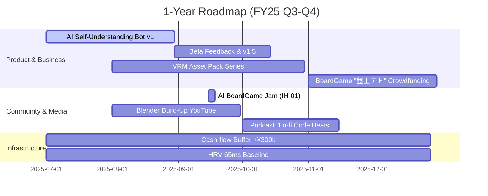

# 0. 読み方ガイド
1. [[../summary/07_goals_plans|Summary]]
2. [[../details/07_goals_plans_details|Details]]
3. 本ファイルで OKR 進捗と次アクションを確認

---

# 1. OKR 2025 Q3 (Jul–Sep)
▼ 今期は「自己理解支援 × 創作 × 国際交流」を三本柱として集中。Objectives は野心的だが、Key Results は 70% 達成で成功基準。

| Objective (野心目標) | Key Result (測定指標・期限) | Weekly Ritual |
|----------------------|--------------------------------|--------------|
| O1: AI × 自己理解コーチングの製品版βをローンチする | KR1-1: GPT-4o Function Calling + Obsidian DB で 自己理解Bot v1 を稼働 (8/31) | 火: Dev Deep Work 2h |
| | KR1-2: βユーザー15名・NPS 8.0 以上 (9/20) | 金: ユーザー Interview 3件 |
| O2: Blender VRM アセットをコモディティ化する | KR2-1: 高品質 VRM キャラ2体 + アニメーション5種 を Booth 公開 (9/15) | 水: Modeling Live 1h |
| | KR2-2: DL 120 / 売上 ¥30,000 (9/30) | 土: SNS タイムラプス投稿 |
| O3: 英語アウトプットの習慣を確立しグローバル露出を得る | KR3-1: Medium 技術記事 4本 (Monthly 2) | 月木: 30min Writing |
| | KR3-2: Discord/Reddit Tech コミュで週25ポスト (avg 5/day) | 毎日: "5-Reply Rule" |
| O4: Fin/Health ベースラインを強化する | KR4-1: 月間キャッシュフロー +¥50k 黒字 (9/月) | 日: QuickBooks Review |
| | KR4-2: HRV (RMSSD) 50ms → 65ms (avg 月間) | 朝: 7h Sleep/日 Tracking |

> Check-in: **日曜夜**に Obsidian オート集計レビュー → 月次 1on1 with GPT-Coach → 公開 Accountability Thread (#GoalCheck).  
> Stretch: OKR 達成率 80% で Bonus Reward = 「小樽 湯治 ワーケーション」計画。

---

# 2. ロードマップ (1Y / 3Y Outlook)
全体ビジョン (国際交流ボドゲカフェ ＆ 創作 × AI) へ向けた段階的マイルストーン。

## 1-Year Roadmap (2025-07 ➜ 2026-06)

## 3-Year North-Star (2025-2028)
1. **2026 Q3:** ボードゲームカフェの PoC Pop-Up (3ヶ月限定) 開催  
2. **2026 Q4:** 自己理解Bot SaaS β版 300 ユーザー / MRR ¥200k 到達  
3. **2027 Q2:** 国際クリエイター Residency プログラム 1 期開催 (6 名)  
4. **2027 Q4:** ボドゲカフェ用 物件購入 or 長期賃貸契約  
5. **2028 Q2:** 「国際交流ボードゲームカフェ」グランドオープン & 創作スタジオ併設  

マイルストーン間の依存関係と資金計画は [[../details/07_goals_plans_details|Details]] に展開。

---

# 3. リスク & ミティゲーション
主要リスクを 5 カテゴリで洗い出し、影響度(⚠)・発生確率(%) を評価。対策レベル (▲) で優先度を図示。

| # | リスク事象 | 影響度⚠ | 確率% | 優先▲ | 予防策 | 発生時対応策 |
|---|------------|--------|------|------|--------|------------|
| R1 | 健康悪化 (ADHD + 過労) | 高 | 40 | ▲▲▲▲ | • HRV/Sleep データ監視 • 毎日 1h 運動・瞑想 | • 作業80%削減 • 医療/コーチ相談 |
| R2 | キャッシュフロー不足 | 高 | 30 | ▲▲▲ | • 3ヶ月分 Buffer 貯蓄 • 収益多角化 | • コスト凍結リスト発動 • 融資/クラファン検討 |
| R3 | GPT API 料金改定 or 使用制限 | 中 | 25 | ▲▲ | • 利益率 30% 以上確保 • オープンソース代替 PoC | • モデル置換: Mixtral, Gemma • 料金転嫁 or プラン変更 |
| R4 | 主要コラボパートナー離脱 | 中 | 20 | ▲▲ | • コミュニティ多層化 • 書面 MoU 作成 | • 役割再配置 • Public Call for Helpers |
| R5 | クリエイティブ燃え尽き | 中 | 35 | ▲▲▲ | • 6-Week Cycle + 1-Week OFF • Boredom Indicator 日次記録 | • 休暇＋新刺激リサーチ • 小規模スプリント切替 |

> Monitoring: Obsidian Dashboard でリスク指標を可視化。月次レビューで更新。 