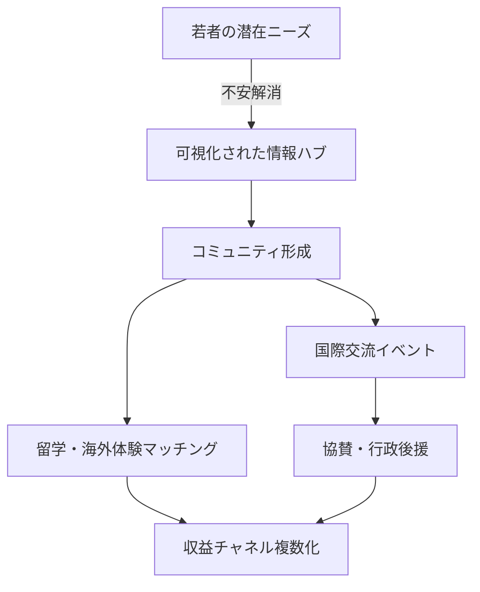

# SmileyFlowers_strategy.md

## 📊 国際教育事業戦略レポート（要約）

> 原本: `../strategy.txt`
> 更新日: 2024-06-13  
> 編集: AIサポート

---

### 1. 市場調査概要（若年層海外志向 & 福岡エリアニーズ）
- **全国的動向**: Z世代の海外渡航意欲は低調。海外留学を全く考えていない若者が57.5%。
- **主要課題**: 経済的負担、語学力不安、治安懸念。
- **福岡エリア**: 中高生の海外志向は高校2年で約3割。保護者の8割は賛成。語学不安が最大の障壁。
- **示唆**: "興味はあるが踏み出せない層"が厚い。不安解消と情報可視化が鍵。

### 2. 参考事例 & トレンド
| タイプ | 代表例 | 主な特徴 |
|--------|--------|-----------|
| 官民協働 | トビタテ！留学JAPAN | 全国規模プラットフォーム型。情報集約 & ネットワーク化。|
| スタートアップ | 留学経験者マッチング, 奨学金マッチング | P2P/企業連携による低コスト・成果報酬モデル。|
| 非営利団体 | 留学支援NPO, 地域国際交流協会 | 利用者負担最小化。助成金・寄付で運営。|

**潮流**: ①オンラインプラットフォーム化 ②公共性志向（低価格／無料）

### 3. 留学マッチング・紹介ビジネスモデル整理
1. **学校/企業からのコミッション** (成果報酬)
2. **利用者サービス料** (相談・手配・講座)
3. **関連サービス販売** (語学講座, 保険, 航空券 等)
4. **広告・スポンサー収入**
5. **補助金・寄付**

> SF社は複数チャネル組合せが持続性に寄与。

### 4. 国際交流イベント成功要因
- 参加者の双方向参加設計
- 興味を共有できる"共通体験"テーマ
- 行政・専門機関のバックアップ
- 地域コミュニティ巻き込み
- 継続的ネットワーク形成

### 5. 協業ポテンシャル（福岡）
| ステークホルダー | 期待メリット | 協業形態例 |
|------------------|--------------|-------------|
| 自治体/公的団体 | 留学生誘致・人材育成 | 後援, 委託事業 |
| 学校・大学 | 国際色PR, 学生ボランティア確保 | 共同イベント, 授業連携 |
| NPO/市民団体 | ミッション共通, 機動力 | 情報発信代行, 合同企画 |
| 企業 | 人材育成, CSR | 奨学金, 協賛, PR |

### 6. 戦略提言 & マネタイズ示唆
1. **情報ハブ & コミュニティプラットフォーム**
2. **低コストサービス + 付加価値課金**
3. **収益源の多角化 (B2C/B2B, 営利/非営利ハイブリッド)**
4. **公共財的ブランディング & 透明性運営**
5. **心理的ハードル低減 + ポジティブ動機づけ**

> 目指す姿: **「福岡の若者と世界をつなぐエコシステム」**

---

### 7. 次アクション案（ドラフト）
- [ ] 既存サービス・パートナー一覧作成
- [ ] プラットフォームMVP企画書作成
- [ ] 行政／大学ヒアリングリストアップ
- [ ] 低コスト試験イベント（オンライン+オフライン）計画
- [ ] 収益シミュレーション（複数チャネル）

---

---

> 補足: 詳細データや事例リストは原本 `strategy.txt` を参照してください。 