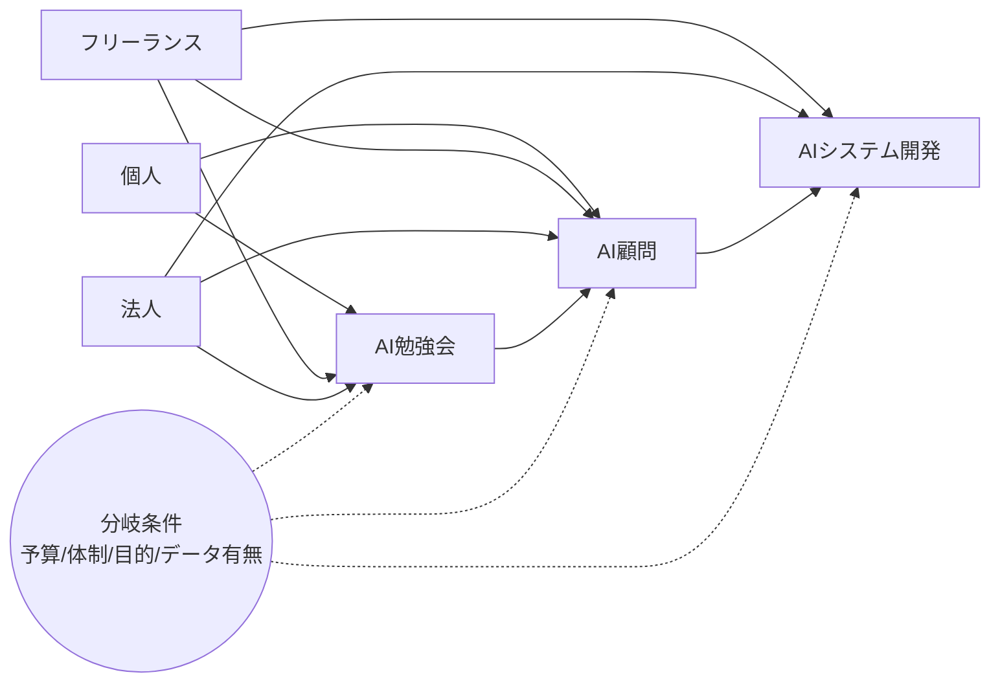

# サービス一覧（統合紹介ページ用）

## 目的
- 目的（1行）：AI活用に関心のある企業が自社に合うサービスを短時間で選べるようにする。
- 期待する成果（例：問い合わせ増、比較の理解促進）：問い合わせ増、離脱率低下、資料請求の増加。
- 想定する閲覧ステージ（認知/比較検討/意思決定）：比較検討〜意思決定。

## ページ全体の要件
- ページ名/URL案：サービス一覧・選び方ガイド（/services/overview など）
- KPI（CVR, CTR, 滞在時間 など）：CVR 2.5%目標、平均滞在2分以上。
- 主要CTA（例：相談/資料請求/問い合わせ）：無料相談/ヒアリング予約。
- 避けたい表現/法務NG：成果保証、過度な断定、業界誤認。
- 競合ページ/参考URL：類似のAI支援会社のサービス一覧ページ。

## 対象サービス一覧
### 1) AI勉強会
- 一言キャッチ：現場が動くAIリテラシーを、短期間で。
- 主要価値/ベネフィット（3点）：
  - 社内のAI理解が揃い、意思決定が速くなる
  - 実務に使えるプロンプト/ワークフローが学べる
  - 小さな成功体験でAI活用の文化が生まれる
- 対象者（業種/職種/規模/レベル）：中小〜中堅企業の管理職/実務担当、AI初学者中心。
- こんな課題の人に最適（3点）：
  - 社内でAI活用の共通言語がない
  - 現場がツールを使いこなせない
  - まず何から始めれば良いか分からない
- 提供形式（例：オンライン/対面/回数/期間）：月1〜2回、オンライン/対面ハイブリッド。
- 料金/プラン（公開可否含む）：応相談（公開は検討）。
- 成果物/アウトプット：社内向け活用資料、テンプレート、簡易マニュアル。
- 代表的な導入事例（任意）：営業チーム向けAI活用研修。

### 2) AI顧問
- 一言キャッチ：AI活用の方向性を、伴走しながら定着へ。
- 主要価値/ベネフィット（3点）：
  - 経営/現場の両視点から導入計画を整理
  - ツール選定と運用設計を継続支援
  - 社内のAI活用をKPIで管理できる
- 対象者（業種/職種/規模/レベル）：経営層/企画/情報システム、AI活用を本格化したい企業。
- こんな課題の人に最適（3点）：
  - AI導入の優先順位が決まらない
  - PoC止まりで運用に乗らない
  - 部門間の調整が難しい
- 提供形式（例：月次/伴走/会議体/ツール）：月次定例＋チャット相談、必要時ワークショップ。
- 料金/プラン（公開可否含む）：月額プラン（公開は検討）。
- 成果物/アウトプット：ロードマップ、KPI設計、活用ガイドライン。
- 代表的な導入事例（任意）：製造業のAI活用ロードマップ策定。

### 3) AIシステム開発
- 一言キャッチ：業務を変えるAIシステムを、実装まで。
- 主要価値/ベネフィット（3点）：
  - 現場課題に合わせたAI機能を実装
  - 既存システムと連携した運用まで設計
  - PoCから本番運用まで一気通貫
- 対象者（業種/職種/規模/レベル）：業務改善/新規事業の責任者、IT部門。
- こんな課題の人に最適（3点）：
  - 手作業が多く業務効率が落ちている
  - AIをシステムとして組み込みたい
  - 内製では開発リソースが足りない
- 提供形式（例：PoC/要件定義/開発/運用）：要件定義→PoC→開発→運用。
- 料金/プラン（公開可否含む）：個別見積。
- 成果物/アウトプット：要件定義書、システム一式、運用設計。
- 代表的な導入事例（任意）：問い合わせ対応AIの導入。

## 利用パターン別の導入ルート（要約版）
### 個人（趣味用途）
- 想定スタート：AIに詳しくないが「何かやってみたい」。
- 入口：AI勉強会で体験→グループで楽しさを実感。
- 次の一手：本気のテーマが出たらAI顧問で個別相談へ。
- ねらい：学びと実験を重ね、必要な時に個別サポートへ移行。

### フリーランス
- 想定スタート：仕事にAIを使いたい、学び方は人による。
- 入口A：AI勉強会で使い方を広く把握。
- 入口B：グループが苦手ならAI顧問から個別伴走で開始。
- 発展1：自分で作れるようになればAI顧問で伴走継続。
- 発展2：自分で作らない領域はAIシステム開発へ依頼。
- 仕上げ：運用はAI顧問で支援し、一定期間後に自走。

### 法人
- 想定スタート：良い研修や導入支援を探している。
- 入口A：AI勉強会→社内研修相談→AI顧問または開発へ。
- 入口B：システム開発から開始→開発後にAI顧問で運用伴走。
- ねらい：研修で理解を揃え、導入/運用は伴走で定着。

## 利用パターン別ページ構成案（カスタマージャーニー）
### 個人（趣味用途）
- ページ目的：AIの楽しさを体験し、次の相談先が分かる。
- 典型フロー：AI勉強会 →（試行/共有）→ AI顧問（必要時）。
- 主要CTA：AI勉強会の参加／個別相談の予約。

### フリーランス
- ページ目的：学びと実装の選択肢を提示し、伴走を訴求。
- 典型フロー：
  - Aルート：AI勉強会 → AI顧問 → 自走
  - Bルート：AI顧問 → AIシステム開発 → AI顧問（運用）→ 自走
- 主要CTA：AI顧問の相談／開発の相談。

### 法人
- ページ目的：研修から導入・運用までの全体像を明示。
- 典型フロー：
  - Aルート：AI勉強会 → 社内研修 → AI顧問 or AIシステム開発
  - Bルート：AIシステム開発 → AI顧問（運用/改善）
- 主要CTA：研修相談／開発相談。

## 比較のための共通項目
- 納期目安：勉強会は最短2週間、顧問は1ヶ月〜、開発は3ヶ月〜。
- 稼働体制（担当人数/役割）：PM＋コンサル＋エンジニア（内容により変動）。
- 必須の事前準備（例：データ/要件/担当者）：担当窓口、現状課題、業務フロー。
- セキュリティ/契約形態（例：NDA, B2B）：NDA締結可、法人契約。
- 対応可能業界/非対応領域：一般企業向け（機微領域は要相談）。
- 価格帯のレンジ（公開可否）：非公開（個別相談）。

## 利用パターン別の導入ルート（図用）
- 入口の種類：個人 / フリーランス / 法人（小規模〜中堅）
- ゴール例：学ぶ → 伴走 → 仕組み化（または単発相談）
- 入口ごとの主導線（仮）：
  - 個人：AI勉強会 → 必要に応じてAI顧問
  - フリーランス：AI勉強会 or AI顧問 → 必要に応じてAIシステム開発
  - 法人：AI顧問 → AIシステム開発（必要に応じてAI勉強会）
- 分岐条件（例）：
  - 予算規模 / 社内体制 / 目的の明確さ / データ有無
- 例外ルート（仮）：
  - 法人でもまず勉強会から始めたいケース
  - 個人でも開発相談だけしたいケース

### 図生成プロンプト（画像生成向け）
以下を元に、フラットで読みやすいフロー図を生成してください。

プロンプト案：
「白背景、緑系アクセント、シンプルな線と丸角カードで構成されたフロー図。タイトルは『利用パターン別の導入ルート』。左から右へ流れる。入口は3つ（個人、フリーランス、法人）を上段に配置。中段にサービス3種（AI勉強会、AI顧問、AIシステム開発）を並べる。矢印で主導線を示す。注釈として分岐条件（予算・体制・目的・データ有無）を小さく配置。配色は#0f5e4a系、文字は見やすい日本語フォント。無機質すぎず温かみのあるビジネスデザイン。」

### 図生成プロンプト（Mermaid向け）

## トーン&メッセージ
- 伝えたい世界観（例：安心、先進性、伴走）：安心感と実務志向、伴走。
- 禁止ワード/過剰表現の回避：成果保証、No.1、絶対に成功。
- 想定読者の不安・誤解：AIは難しい/高額/使いこなせない。

## CTA・導線
- 第一CTA文言：無料相談はこちら
- 第二CTA（補助）：資料請求/事例をもっと見る
- 連絡先/フォーム/日程調整：問い合わせフォーム＋日程調整リンク。

## 素材
- 必須画像/図解（構成案）：3サービス比較表、導入フロー図。
- ロゴ/事例素材：導入企業ロゴ（許諾がある場合）。
- 図表にしたい数値：支援社数、研修回数、開発件数。
